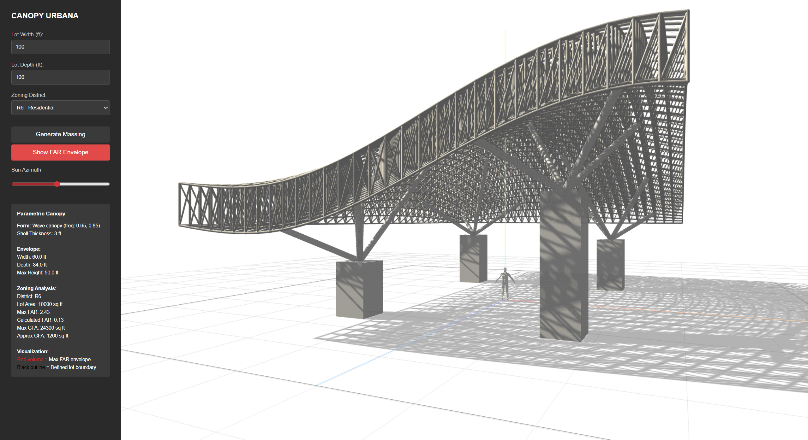

## CANOPY URBANA
is a full-stack computational framework that utilizes New York City zoning ordinances 
as generative design parameters to create responsive 3D spaceframes. By bridging 
a RESTful API backend with an interactive Three.js frontend, the system allows 
designers to visualize the maximum potential of a buildable envelope based on 
custom lot dimension inputs on the web.

The project explores the application of large-scale spaceframes as a solution for 
much-needed public gathering nodes within Manhattan. The workflow enables rapid 
scenario testing by evaluating floor area ratio (FAR), sky exposure planes, and 
volumetric distribution while providing immediate feedback on how these iterations 
respond to daylighting and shadow behavior across various NYC district zones.

### Recommended Usage Instructions

1. Open **two terminals** in VS Code:
   - **Terminal 1** → `/backend`
   - **Terminal 2** → `/frontend`

2. Install **Node.js** for the following commands to work

3. **Terminal 1 (Backend)**
   ```bash
   cd backend
   node server.js

4. **Terminal 2 (Frontend)**
   ```bash
   cd frontend
   npx http-server -p 8080
   http://localhost:8080

5. Use **ctrl+shift+r** in the local server to refresh for changes


